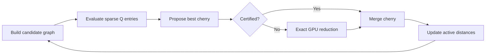

# GPU-Accelerated Differentiable Neighbor Joining for Multiple-Sequence Alignment Phylogenetics

A phylogenetic distance matrix is not merely a positive-definite covariance object: an additive tree metric must satisfy tree-specific constraints, while the number of binary tree topologies on $n$ taxa grows as $(2n-3)!!$. [Variational Combinatorial Sequential Monte Carlo for Bayesian Phylogenetics in Hyperbolic Space](https://www.alphaxiv.org/abs/2501.17965) frames this combinatorial growth as a central obstacle to scalable inference. [Introduction](https://www.alphaxiv.org/abs/2501.17965v2?page=1)

This note develops a GPU-oriented approach to Neighbor Joining (NJ) for multiple-sequence alignments (MSAs), while connecting it to three related ideas:

1. **LKJ-style parameterizations of correlation matrices**;
2. **hyperbolic embeddings and Riemannian geometry for tree-like data**; and
3. **differentiable relaxations of discrete tree construction.**

The central proposal is a **certified sparse-candidate NJ algorithm**: use GPU-friendly sequence embeddings or sketches to reduce the number of candidate NJ joins, but retain exact checks or repair passes so that approximate pruning does not silently change the output tree.

## 1. Problem setting

Let an MSA contain $n$ aligned sequences of length $L$. A standard distance-based phylogenetic pipeline is


The pairwise evolutionary distance matrix is

$$
D = \left[d_{ij}\right]_{i,j=1}^n,
$$

where $d_{ij}$ estimates evolutionary separation between taxa $i$ and $j$. Neighbor Joining iteratively selects pairs using the $Q$-criterion:

$$
Q_{ij} = (m-2)d_{ij} - r_i - r_j,
\qquad
r_i = \sum_{k=1}^{m} d_{ik},
$$

where $m$ is the number of active clusters at the current step.

After joining taxa or clusters $i$ and $j$ into a new node $u$, NJ updates distances by

$$
d_{u,k} =
\frac{d_{i,k}+d_{j,k}-d_{i,j}}{2}.
$$

Classical NJ has an $O(n^3)$ time complexity because each of roughly $n$ rounds requires evaluating or reducing over $\Theta(n^2)$ pair scores.

## 2. Why the LKJ intuition is useful—but not the same problem

The [LKJ correlation distribution](https://www.alphaxiv.org/abs/2608.06116) is a prior over valid correlation matrices. Its basic domain is the set of symmetric positive-definite correlation matrices:

$$
\mathcal{C}_n
=
\left\{
R \in \mathbb{R}^{n\times n}
:
R=R^\top,\,
R \succ 0,\,
\operatorname{diag}(R)=\mathbf{1}
\right\}.
$$

A covariance matrix can be parameterized by a Cholesky factor:

$$
\Sigma = LL^\top,
$$

which turns positive-definiteness into a structural property of the parameterization. This is extremely useful in Bayesian statistics: rather than optimizing directly over arbitrary matrices and repeatedly testing whether they are valid, one optimizes unconstrained or lightly constrained parameters that decode into a valid $\Sigma$.

That intuition transfers to phylogenetics at a high level:

> Find a continuous parameter space in which optimization is easy, then decode its points into structured biological objects.

But the target structure differs substantially.

| Object | Validity condition | Natural continuous representation |
|---|---|---|
| Correlation matrix | Positive-definite with unit diagonal | Cholesky factor, partial correlations, LKJ prior |
| Euclidean distance matrix | Squared distances induced by Euclidean coordinates | Points in $\mathbb{R}^d$ |
| Additive tree metric | Distances induced by weighted paths on a tree | Tree topology plus nonnegative branch lengths |
| Distribution over phylogenetic trees | Probability mass over discrete topologies and continuous lengths | Continuous latent coordinates plus a tree decoder |

A generic positive-definite matrix does not encode a phylogenetic tree. Conversely, a tree-derived distance matrix need not be treated as a covariance matrix. The key phylogenetic constraint is **additivity**: for a tree metric, distances are sums of branch lengths along unique paths between leaves.

For any four leaves $a,b,c,d$, an exact tree metric obeys the four-point condition: among

$$
d_{ab}+d_{cd},\qquad
d_{ac}+d_{bd},\qquad
d_{ad}+d_{bc},
$$

the two largest values are equal. Sequence-derived distances only approximately obey this condition because of finite sequence length, model mismatch, rate variation, recombination, and estimation noise.

Thus, the right analogue to an LKJ parameterization is **not** “put the distance matrix on an SPD manifold.” It is:

- use a geometry that represents hierarchical structure efficiently;
- use a decoder that maps continuous variables back to tree topologies and branch lengths;
- preserve or validate the phylogenetic likelihood under that decoding.

## 3. Why hyperbolic geometry is relevant

In Euclidean space, the volume of a ball grows polynomially with radius. In negatively curved hyperbolic space, it grows exponentially. This makes hyperbolic geometry well suited to hierarchical and tree-like structures.

The Poincaré disk is

$$
\mathbb{D}^{d}
=
\left\{
z \in \mathbb{R}^{d}:\|z\|<1
\right\}.
$$

Its metric is conformally scaled:

$$
ds^2
=
\frac{4\,\sum_{i=1}^{d} dz_i^2}
{(1-\|z\|^2)^2}.
$$

As $\|z\| \to 1$, distances diverge. Points near the boundary can therefore represent many increasingly separated leaves or subclades. [Variational Combinatorial Sequential Monte Carlo for Bayesian Phylogenetics in Hyperbolic Space](https://www.alphaxiv.org/abs/2501.17965) describes this directly: the geometry’s expanding neighborhoods reflect the combinatorial expansion of phylogenetic topologies. [Hyperbolic Motivation](https://www.alphaxiv.org/abs/2501.17965v2?page=1)

For $z_1,z_2 \in \mathbb{D}^d$, hyperbolic distance is

$$
d_{\mathbb{D}}(z_1,z_2)
=
\operatorname{arcosh}
\left(
1+
\frac{2\|z_1-z_2\|^2}
{(1-\|z_1\|^2)(1-\|z_2\|^2)}
\right).
$$

The Poincaré disk is only one representation; the hyperboloid/Lorentz model, Poincaré half-plane, and Klein model describe equivalent hyperbolic geometries. [Geometry Models](https://www.alphaxiv.org/abs/2501.17965v2?page=2)

### Important qualification

Hyperbolic coordinates are a useful low-dimensional *representation* of tree-like distances, but they are not an exact lossless replacement for every sequence-derived distance matrix or every phylogenetic posterior.

[Differentiable Phylogenetics via Hyperbolic Embeddings with Dodonaphy](https://www.alphaxiv.org/abs/2309.11732) explicitly treats the encoding as approximate: embedding an input tree and decoding it again may not return the original tree. [Hyperbolic Encoding](https://www.alphaxiv.org/abs/2309.11732v1?page=5)

That makes hyperbolic geometry particularly valuable for:

- initialization;
- proposal distributions;
- candidate-neighbor generation;
- approximate posterior representations; and
- differentiable optimization over a continuous latent space.

It should not automatically replace exact phylogenetic scoring.

## 4. Differentiable topology inference

The challenge in optimizing phylogenies is that branch lengths are continuous but topologies are discrete. A local change in embedding coordinates can cause a discontinuous change in the decoded tree.

[Differentiable Phylogenetics via Hyperbolic Embeddings with Dodonaphy](https://www.alphaxiv.org/abs/2309.11732) addresses this with **soft-NJ**. It embeds leaves in hyperbolic space, computes pairwise distances, runs a differentiable relaxation of Neighbor Joining, and propagates gradients from a phylogenetic objective back to the embedding locations. [Method Overview](https://www.alphaxiv.org/abs/2309.11732v1?page=2)

The forward map can be written as

$$
(\mathbb{H}^{d})^n
\;\xrightarrow{\;d_{\kappa}\;}\;
\mathbb{R}^{\binom{n}{2}}
\;\xrightarrow{\;\mathrm{soft\mbox{-}NJ}\;}\;
\mathcal{T}_n
\;\xrightarrow{\;\mathcal{L}\;}\;
\mathbb{R},
$$

where:

- $\mathbb{H}^d$ is hyperbolic space;
- $d_{\kappa}$ computes hyperbolic pairwise distances;
- $\mathrm{soft\mbox{-}NJ}$ decodes a tree;
- $\mathcal{T}_n$ is tree space; and
- $\mathcal{L}$ is a likelihood or variational objective.

Soft-NJ replaces NJ’s hard minimum selection with a SoftSort relaxation over the flattened upper triangle of the $Q$ matrix. The temperature $\tau$ controls the tradeoff: as $\tau \to 0$, the relaxation approaches discrete NJ, but gradients become less smooth. [Soft-NJ](https://www.alphaxiv.org/abs/2309.11732v1?page=7)

[GeoPhy: Differentiable Phylogenetic Inference via Geometric Gradients of Tree Topologies](https://www.alphaxiv.org/abs/2307.03675) takes a related but distinct route. It parameterizes a distribution over continuous leaf coordinates, maps samples to tree topologies, and uses stochastic gradient estimators with variance-reduction control variates rather than differentiating directly through the discrete topology map. [GeoPhy Formulation](https://www.alphaxiv.org/abs/2307.03675v2?page=5)

This distinction matters:

- **Soft-NJ:** relax the discrete decoder itself.
- **GeoPhy:** retain a discrete decoder but optimize a variational distribution over its continuous inputs.
- **Hyperbolic sequential Monte Carlo:** use curved geometry to construct better proposals while explicitly exploring topological alternatives.

## 5. GPU opportunity: certified sparse-candidate Neighbor Joining

A GPU implementation should target the actual bottleneck: global pair scoring and repeated matrix updates, not merely the final $O(n^2)$ distance-matrix construction.

The proposed algorithm has four components.

### 5.1 GPU pairwise evolutionary distances

Encode the MSA compactly, for example using 2-bit nucleotide encodings plus masks for ambiguous characters and gaps. Compute pairwise counts in tiles, then apply the chosen correction model.

For a simple mismatch distance,

$$
p_{ij}
=
\frac{
\#\{\text{comparable aligned sites where }x_i \neq x_j\}
}{
\#\{\text{comparable aligned sites}\}
}.
$$

Under the Jukes–Cantor correction,

$$
d_{ij}
=
-\frac{3}{4}
\log
\left(
1-\frac{4}{3}p_{ij}
\right).
$$

The GPU workload is naturally tiled across sequence pairs and alignment columns:

```text
MSA tiles → mismatch / substitution counts → distance correction → blocked D matrix
```

This stage is highly parallel and bandwidth-sensitive. It benefits from:

- packed sequence storage;
- warp-level population counts;
- shared-memory tiles;
- fused gap masking and mismatch accumulation;
- FP32 accumulation and optional FP16/BF16 storage where numerical error is acceptable.

### 5.2 Candidate construction

Instead of scoring all $\binom{m}{2}$ pairs at every NJ round, construct a sparse candidate graph with $k$ likely neighbors per active cluster.

Candidate generators could include:

- minimizer or $k$-mer sketches;
- random projections of sequence features;
- approximate nearest-neighbor search over sequence embeddings;
- low-dimensional hyperbolic embeddings fitted to the current distance matrix; or
- current cluster-distance neighbors.

The sparse edge set is

$$
E_k
=
\{
(i,j):
j \in \operatorname{TopK}(i)
\},
\qquad
|E_k| \approx O(mk).
$$

Then compute $Q_{ij}$ only for $(i,j) \in E_k$:

$$
Q_{ij}^{(k)}
=
(m-2)d_{ij}-r_i-r_j,
\qquad
(i,j)\in E_k.
$$

This reduces the candidate scoring phase from $O(m^2)$ to approximately $O(mk)$ per iteration when $k \ll m$.

### 5.3 Certification and repair

Sparse candidate selection is not automatically exact because NJ’s $Q$ criterion contains global row-sum corrections. The correct research design is therefore **approximate proposal, exact validation**.



Possible certification levels are:

1. **Exact every round**  
   Use sparse candidates for a cheap proposal, then verify with an exact full $Q$ reduction. This may reduce control overhead but does not change asymptotic complexity.

2. **Exact periodic repair**  
   Perform exact reductions every $r$ rounds, or whenever candidate confidence is low.

3. **Row-wise certification**  
   Verify that each endpoint has no lower-$Q$ partner outside the candidate set, then perform a global candidate reduction.

4. **Likelihood-aware repair**  
   Permit approximate joins in batches, then compare local or full likelihood after refinement and revisit failures.

The central empirical question is candidate recall:

$$
\operatorname{Recall@}k
=
\frac{
\#\{\text{exact NJ cherries contained in }E_k\}
}{
\#\{\text{NJ iterations}\}
}.
$$

If the exact NJ cherry appears in a small $k$-candidate neighborhood on most iterations, the global work can be sharply reduced without sacrificing accuracy in a certified mode.

### 5.4 Batched non-conflicting merges

Standard NJ selects one cherry per iteration. A more aggressive GPU design identifies a matching of disjoint low-$Q$ pairs:

$$
M \subseteq E_k,
\qquad
(i,j),(u,v)\in M
\Rightarrow
\{i,j\}\cap\{u,v\}=\varnothing.
$$

Pairs in $M$ can be updated concurrently. This introduces risk because serial NJ order can matter, so it should be viewed as a speculative optimization:

- merge a matching of confidently separated cherries;
- update all corresponding rows in parallel;
- detect conflicts or failed validations;
- fall back to serial exact NJ within ambiguous regions.

The likely best use case is datasets with strongly resolved clades, where several cherries are geographically and evolutionarily separated.

## 6. Relationship between hyperbolic embeddings and GPU-NJ

Hyperbolic geometry should be used as an accelerator for *search*, not as a guarantee that a tree can be recovered exactly from a low-dimensional embedding.

A useful hybrid pipeline is:


The embedding can be optimized to preserve local evolutionary neighborhoods:

$$
\mathcal{L}_{\mathrm{embed}}
=
\sum_{(i,j)\in \mathcal{P}}
w_{ij}
\left(
d_{\mathbb{H}}(z_i,z_j)-d_{ij}
\right)^2,
$$

where $\mathcal{P}$ may be all pairs for small datasets or a sampled subset for large ones.

The goal is not necessarily to reconstruct the full distance matrix faithfully. For candidate NJ, the more relevant goal is to preserve **join-relevant neighborhoods**:

$$
\operatorname{TopK}_{j}\big(-Q_{ij}\big)
\approx
\operatorname{TopK}_{j}\big(-d_{\mathbb{H}}(z_i,z_j)\big).
$$

This gives a clear training or evaluation criterion: measure whether embedding neighborhoods recover exact NJ candidates.

## 7. Relevant modern literature

| Paper | Relevance |
|---|---|
| [Differentiable Phylogenetics via Hyperbolic Embeddings with Dodonaphy](https://www.alphaxiv.org/abs/2309.11732) | Introduces Soft-NJ, a differentiable NJ relaxation for likelihood-based optimization from hyperbolic leaf embeddings. It reports that non-convexity and “geometric frustration” can create local optima. [Geometric Frustration](https://www.alphaxiv.org/abs/2309.11732v1?page=9) |
| [GeoPhy: Differentiable Phylogenetic Inference via Geometric Gradients of Tree Topologies](https://www.alphaxiv.org/abs/2307.03675) | Builds variational phylogenetic inference over continuous Euclidean or hyperbolic leaf-coordinate distributions, avoiding a preselected finite topology set. [Contribution](https://www.alphaxiv.org/abs/2307.03675v2?page=2) |
| [Variational Combinatorial Sequential Monte Carlo for Bayesian Phylogenetics in Hyperbolic Space](https://www.alphaxiv.org/abs/2501.17965) | Uses hyperbolic proposals in sequential Monte Carlo. Its PyTorch implementation is vectorized over particles and sites except for resampling; reported experiments use an NVIDIA A100 GPU. [Implementation](https://www.alphaxiv.org/abs/2501.17965v2?page=8) |
| Poincaré Embeddings for Learning Hierarchical Representations | Foundational machine-learning argument for representing hierarchical structures in negatively curved geometry. |
| Hyperbolic Neural Networks | Provides practical Riemannian operations—exponential maps, logarithmic maps, and hyperbolic neural layers—for optimization in negatively curved spaces. |
| [Generating Random Correlation Matrices Based on Vines and Extended Onion Method](https://doi.org/10.1016/j.jmva.2009.04.008) | Original LKJ construction for correlation matrices; conceptually useful for understanding constrained matrix parameterizations, but not a direct phylogenetic-tree parameterization. |

## 8. Experimental plan

The project should report four separate outcomes.

### Exactness

Compare against a trusted CPU or GPU exact NJ implementation.

- Robinson–Foulds distance between inferred trees;
- proportion of NJ steps matching exact NJ;
- candidate recall at $k \in \{8,16,32,64,128\}$;
- branch-length error after tree reconstruction.

### Computational performance

Measure separately:

- MSA-to-distance-matrix time;
- row-sum and $Q$-matrix reduction time;
- distance-update time;
- candidate-graph construction time;
- GPU memory use;
- end-to-end wall-clock time.

### Biological quality

Evaluate final trees using:

- likelihood after a common branch-length optimization procedure;
- comparison with maximum-likelihood trees;
- bootstrap or posterior split support where appropriate;
- sensitivity to substitution model, gaps, and noisy distances.

### Failure modes

Explicitly test:

- star-like or weakly resolved phylogenies;
- long-branch attraction;
- heterogeneous rates;
- recombinant sequences;
- deeply divergent taxa;
- large clades with near-tied $Q$ scores.

## 9. Main claim to test

The strongest version of the research hypothesis is:

> For realistic biological MSAs, the exact Neighbor-Joining cherry lies within a small, GPU-generated candidate neighborhood for most iterations; sparse scoring plus occasional exact repair can therefore preserve NJ topology while substantially reducing global pair evaluation.

That claim is more specific and more valuable than “NJ on a GPU is fast.” It connects phylogenetic geometry, hyperbolic representations, constrained continuous parameterizations, and GPU systems design into a measurable algorithmic contribution.